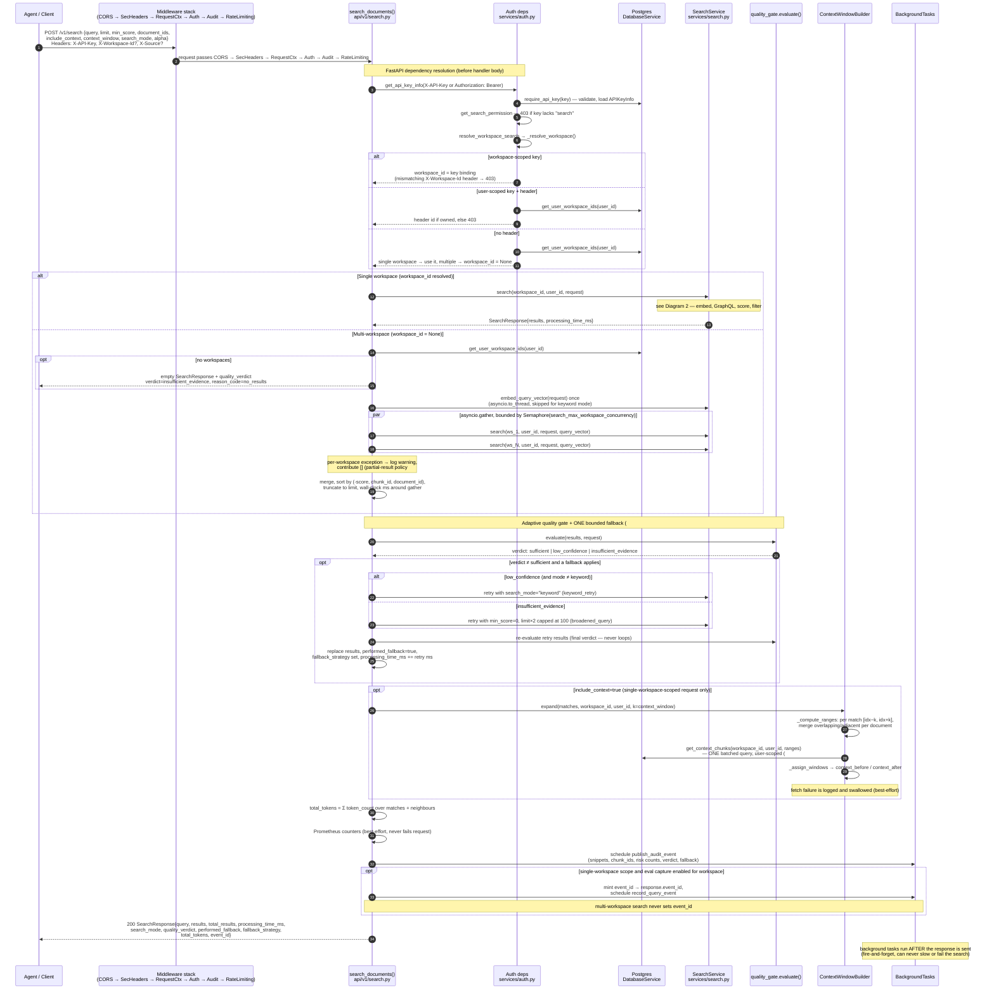
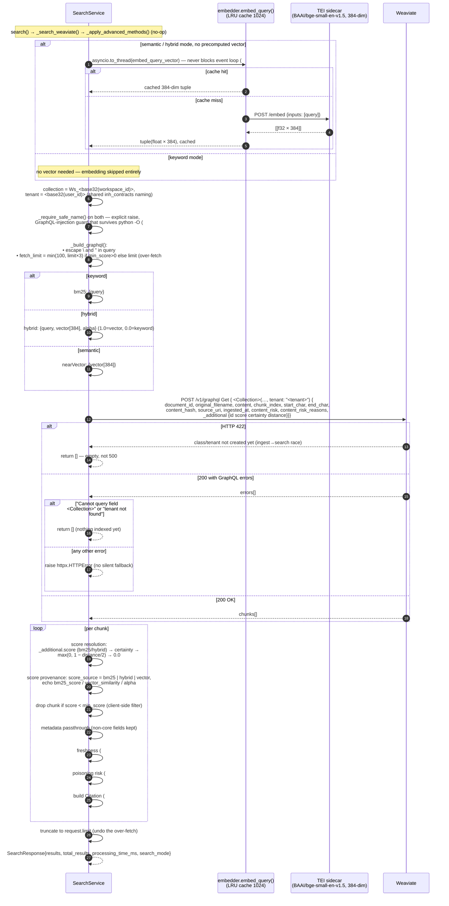
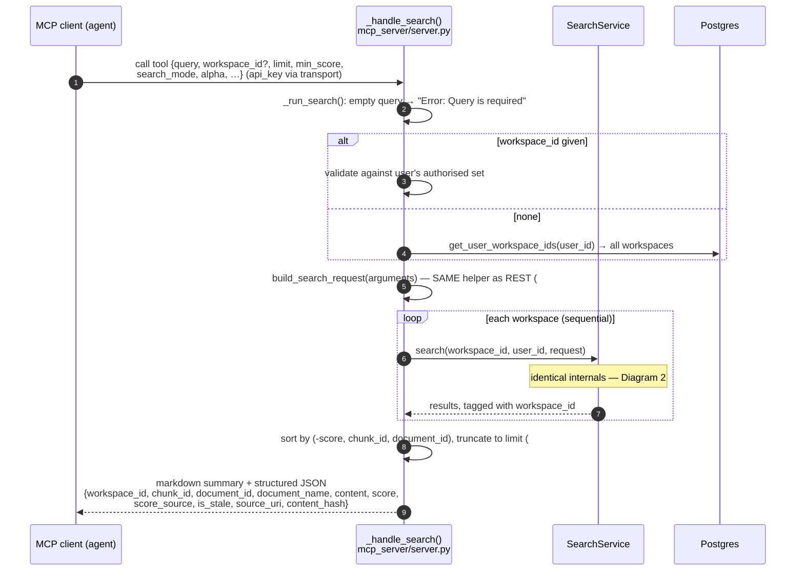
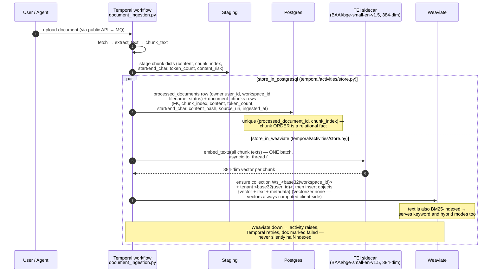

---
search:
  exclude: true
---

# Search — sequence diagrams

Traces the full search path at micro level. All file references are relative to
`services/inh-public-api-svc/src/`.

Four diagrams:

1. [End-to-end REST flow](#1-end-to-end-rest-flow--post-v1search) — `POST /v1/search`
2. [Micro level inside `SearchService.search()`](#2-micro-level--inside-searchservicesearch)
3. [MCP surface](#3-mcp-surface--search_documents--search_memory-tools) — `search_documents` / `search_memory`
4. [Storage roles — upload to query](#4-storage-roles--weaviate-vs-postgres-upload-to-query) — how Weaviate and Postgres split the work

## 1. End-to-end REST flow — `POST /v1/search`

## 2. Micro level — inside `SearchService.search()`

## 3. MCP surface — `search_documents` / `search_memory` tools

## Behavioural invariants

- **Single-shot fallback**: the quality-gate retry (`api/v1/search.py`) is
  bounded to one attempt by construction — the retry's verdict is recorded but
  never triggers another fallback, and a fallback exception is swallowed so it
  can never fail the original request.
- **Context expansion only for single-workspace-scoped requests**: expanding a
  match against a workspace that isn't its own risks a cross-tenant neighbour
  read (#30), so `include_context` is honoured only when the request resolves
  to a single `workspace_id` (workspace-scoped key, `X-Workspace-Id`, or sole
  owned workspace). Multi-workspace fan-out (`workspace_id is None`) skips it.
- **Three-layer tenant isolation**: workspace collection + user tenant on every
  Weaviate query, `_require_safe_name` against GraphQL injection, and the
  fan-out only over `get_user_workspace_ids` — a fallback retry can never widen
  workspace scope.
- **MCP vs REST**: MCP searches workspaces sequentially (no semaphore/gather)
  and has no quality gate/fallback and no context-window expansion — those are
  REST-endpoint features layered above `SearchService`.
- **Eval capture is single-workspace only**: `event_id` / `record_query_event`
  run only when the REST request resolved a single `workspace_id`. Multi-
  workspace search never sets `event_id`.
- **Nothing after retrieval slows the response**: audit publishing, eval
  capture, and metrics are background/best-effort; a cold DB or down MQ never
  affects the serving path.

## 4. Storage roles — Weaviate vs Postgres (upload to query)

Dual-store architecture: **Weaviate is the search index, Postgres is the
system of record**. A single search touches both, at different moments, for
different jobs. Ingestion file references are relative to
`services/inh-ingestion-svc/src/`.

### Ingestion — one document, two stores

The live path is the Temporal workflow
(`temporal/workflows/document_ingestion.py`). After extraction and chunking,
staged chunks are written to both stores in parallel activities.

After upload the same chunk exists twice: in Weaviate as
*(vector + text + metadata)* for retrieval, in Postgres as an ordered row for
everything else.

### Query — how the stores alternate

1. **Postgres — authorization first.** API-key validation and
   `get_user_workspace_ids(user_id)` decide which workspaces the fan-out may
   touch. Weaviate is never queried for a workspace Postgres didn't authorize.
2. **TEI — query becomes a vector.** Same model as ingestion
   (`EMBEDDING_MODEL_ID`, default `BAAI/bge-small-en-v1.5`, 384-dim), so
   query↔chunk cosine comparison is meaningful. Keyword mode skips this.
3. **Weaviate — the actual search.** `nearVector` / `hybrid` / `bm25` per
   workspace, scoped to collection + tenant. Ranking and scoring is purely
   Weaviate — Postgres plays no part.
4. **Postgres — context expansion.** With `include_context=true` on a
   single-workspace-scoped request, `ContextWindowBuilder` fetches the chunks
   *around* each match (`[idx−k, idx+k]`) from `document_chunks` in one batched
   range query — trivial in SQL, awkward in a vector store; this is why the dual
   store exists. The join to `processed_documents.user_id` stops a shared
   workspace leaking another user's neighbour chunks (#41). The rows'
   `token_count` powers `total_tokens`, so an agent knows the context-budget
   cost up front.
5. **Postgres — after the response.** Eval-capture events are written in
   background tasks on single-workspace searches only, never on the serving
   path.

### Division of labour

| Concern | Store |
|---|---|
| Who are you, which workspaces you may search | Postgres |
| Which chunks match the query (rank + score) | Weaviate |
| What surrounds a match (context windows, chunk order) | Postgres |
| Token accounting (`total_tokens`) | Postgres (`token_count`) |
| Document delete | Both — vectors deleted first, then the DB row, so orphaned vectors never survive a "deleted" document (#87) |

Failure-mode consequence of the split: Postgres may hold a document's rows
before its vectors land in Weaviate (the ingest→search race) — the document
only becomes findable once Weaviate has it; until then search returns empty,
not an error.
